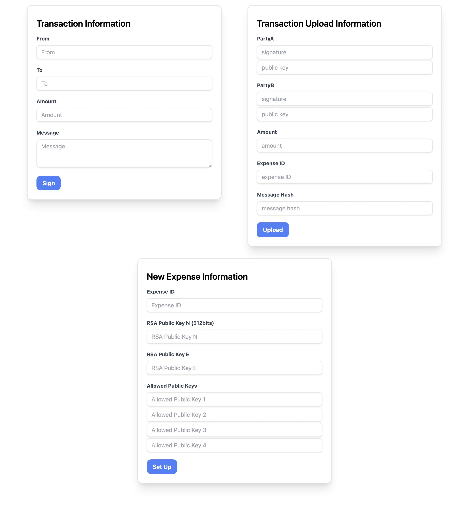
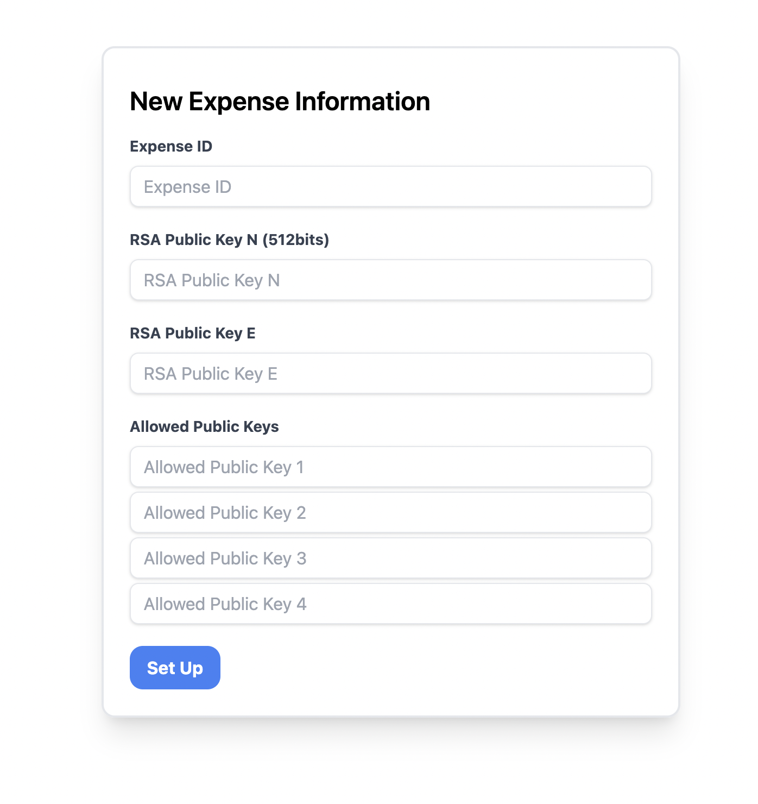
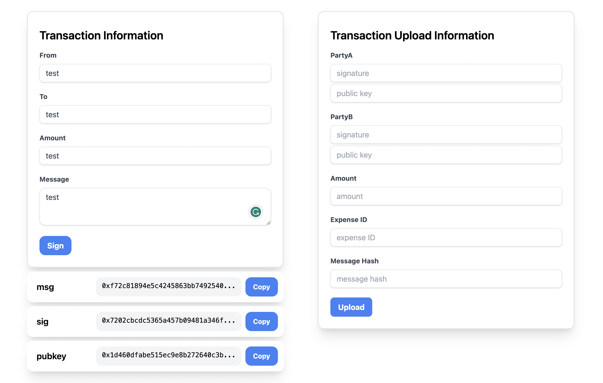
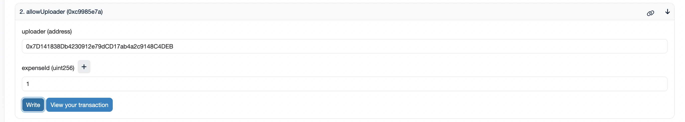
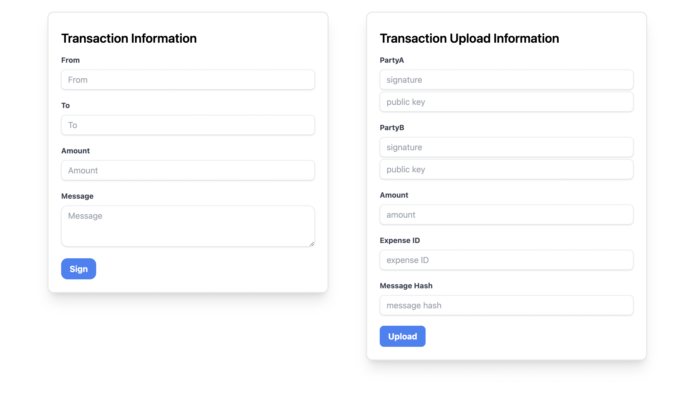

# Zeimbursement system
This is a ZK project that aims for storing transactions inside a company or other organization on-chain without disclosing any information.

1. Installation
   
   ```
   npm install
   ```
   **Make sure you have Wallet like metamask installed in the browser**

   Download zkey of ECDSA from [Here](https://drive.google.com/file/d/1oxt_GAueedCzYYuMzLTAOb3e-WA5dOgf/view?usp=sharing), And place it under ```public/circuits/ecdsa```

2. Run the Web

   ```
   npm run start
   ```
3. Usage
   
   1. Initial Page (default http://localhost:3000/) 
   
      


   2. First, we set up a new expense (can be like annual revenue)

      

      - The Expense ID should be an Integer
      - RSA Public Key N should also be an Integer of 512 bits (can be in hex form, beginning with 0x), which is the modulus of RSA Public Key
      - RSA Public Key E should also be an Integer, which is the exponent of RSA Public Key
      - Allowed Public Keys tentatively is restricted to 4 Keys. 

      Expense ID means you set up a expense on-chain. And RSA Public Keys is used to encrypt the amoount for every transaction uploaded. When the time comes, the admin who set up this expense can disclose the private key, in order to show their accounting is right by verifying the amount of every transaction uploaded. The allowed public keys is used to verify every uploaded transaction is signed by the person of the allowed public keys.
   
   3. Second, if we want to upload a transaction, we first sign it.

      

      On the left, the *From*, *To*, *Amount*, *Message* is subject to your choice. After clicking *Sign*, the wallet would pop up for you to sign. Then, the *msg* (Message Hash), *sig* (Signature), and *pubkey (Your public key) would appear below the box.

   3. Third, we need to allow the uploaders.

      

      Heading to https://goerli.etherscan.io/address/0x4765689Ba8a6fec5254000A5b23eA204EF0034aB, as a admin who set up the expense, for people to upload transaction for that expense, we need to designate who can upload transactions.

   4. Last, we upload the transaction.
   
      

      On the right, we fill the *signature* by the one provided by 3. and the *public key* (can also be derived from 3.) of the two parties of a transaction(means the Parties should both sign the transaction). Then, after the *Amount*, *Expense ID*, and *Message Hash* (can also be derived in 3.) are filled, click the *Upload*.

      First, the frontend will get the proof by snarkjs, and then interact with the contract.

      P.S. *Upload* might take gigantic amount of time. This is still being worked on.